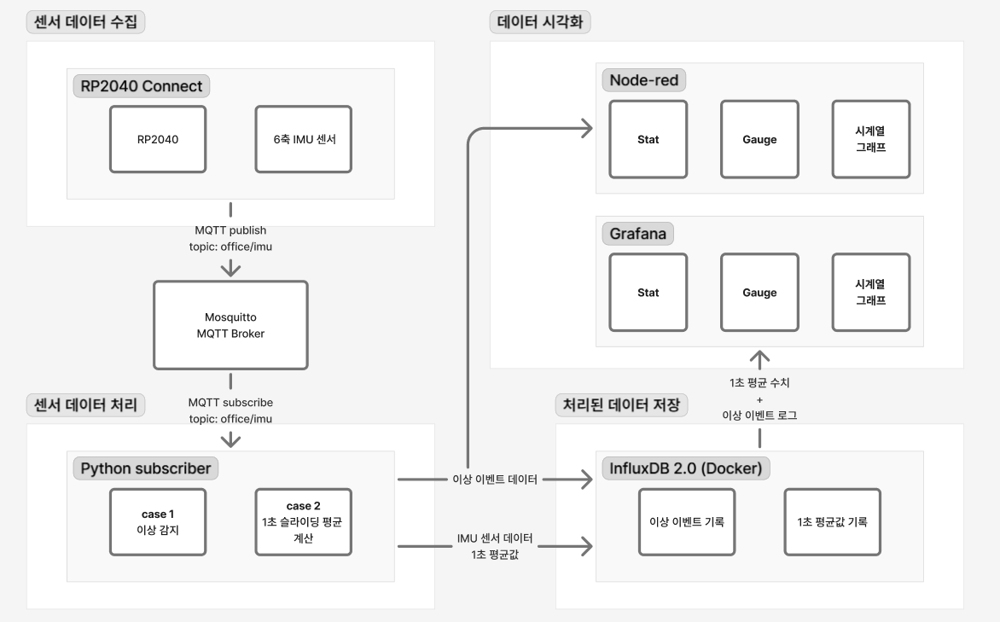

# Intelligent Office Monitoring System

> RP2040 기반 IMU 센서 데이터를 MQTT → Python → InfluxDB → Grafana 파이프라인으로 처리하는 실시간 사무실 모니터링 시스템

---

## 목차

1. [프로젝트 개요](#1-프로젝트-개요)
2. [기술 스택](#2-기술-스택)
3. [시스템 아키텍처](#3-시스템-아키텍처)
4. [논리적 데이터 흐름](#4-논리적-데이터-흐름)
5. [핵심 로직 상세](#5-핵심-로직-상세)
6. [개발 워크플로우](#6-개발-워크플로우)
7. [설치 및 실행](#7-설치-및-실행)
8. [디렉토리 구조](#8-디렉토리-구조)

---

## 1. 프로젝트 개요

사무실 환경에서 발생하는 물리적 이벤트(진동, 충격, 기울기)를 **Arduino Nano RP2040 Connect**의 IMU 센서로 수집하고, 이를 실시간으로 처리·저장·시각화하는 IoT 모니터링 시스템이다.

### 해결하는 문제

| 문제 | 해결 방법 |
|------|-----------|
| 유선 연결의 물리적 제약 | RP2040의 Wi-Fi 내장 모듈로 무선 MQTT 발행 |
| Raw 데이터 폭증 및 노이즈 | Python에서 1초 단위 평균값 집계로 정제 |
| 관계형 DB의 시계열 처리 한계 | InfluxDB 2.0 (시계열 전용 DB) 도입 |
| 복잡한 실시간 시각화 구현 비용 | Grafana 대시보드 활용 |

---

## 2. 기술 스택

### 센서 수집
| 도구 | 역할 |
|------|------|
| **Arduino Nano RP2040 Connect** | IMU(LSM6DS3) 센서 데이터 수집 및 MQTT 발행 |
| **Wi-Fi (내장)** | 유선 없이 로컬 네트워크 연결 |

### 메시지 전달 및 처리
| 도구 | 역할 |
|------|------|
| **Mosquitto (MQTT Broker)** | 센서 → 처리 서버 간 메시지 중계 |
| **Python + uv** | 1초 평균 계산, 이상 징후 감지, DB 저장 |

### 데이터 저장
| 도구 | 역할 |
|------|------|
| **InfluxDB 2.0 (Docker)** | 1초 평균값(`imu_averaged`) + 이상 이벤트(`anomaly_events`) 시계열 저장 |

### 시각화
| 도구 | 역할 |
|------|------|
| **Grafana 13.0 (Docker)** | InfluxDB 데이터를 2초마다 쿼리하여 Stat / Gauge / 그래프 / 이벤트 테이블 렌더링 |
| **Node-RED** | MQTT 경고 보조 모니터링 |

### 개발 환경
| 도구 | 역할 |
|------|------|
| **Windows OS** | 개발 호스트 OS |
| **VS Code + Claude Code** | Vibe-coding 기반 AI 협업 개발 |
| **GitHub** | 버전 관리 및 커밋/푸시 루틴 |
| **uv** | Python 가상환경 및 의존성 관리 |

---

## 3. 시스템 아키텍처



---

## 4. 논리적 데이터 흐름

### Step 1 — 수집 (RP2040 → MQTT)

RP2040 Connect의 LSM6DS3 IMU는 가속도(accel_x/y/z)와 자이로(gyro_x/y/z) 데이터를 지속적으로 샘플링한다. 유선 직렬 통신의 공간적 제약을 극복하기 위해 내장 Wi-Fi 모듈을 통해 JSON 페이로드를 MQTT 토픽(`office/imu`)에 발행한다.

```json
{
  "accel_x": 0.12, "accel_y": -0.03, "accel_z": 9.81,
  "gyro_x": 0.01,  "gyro_y":  0.02,  "gyro_z": -0.01
}
```

### Step 2 — 전송 (Mosquitto 브로커)

Mosquitto MQTT 브로커가 발행자(RP2040)와 구독자(Python) 사이에서 메시지를 비동기적으로 중계한다. 브로커를 통한 디커플링 구조로 인해 구독자가 일시적으로 오프라인 상태여도 데이터 손실 없이 재연결 후 수신이 가능하다.

### Step 3 — 가공 (Python 구독자)

Python 스크립트가 MQTT 토픽을 구독하여 두 가지 핵심 로직을 실행한다.

1. **1초 평균 정제**: 고빈도 Raw 데이터를 1초 단위로 집계하여 노이즈를 제거하고 저장 부하를 감소시킨다.
2. **이상 징후 감지**: 집계된 데이터 또는 순간 Raw 데이터에서 임계값을 초과하는 급격한 변화를 감지한다.

### Step 4 — 저장 (InfluxDB 2.0)

가공된 평균값과 이상 징후 이벤트를 InfluxDB에 별도 measurement로 기록한다. 관계형 DB 대비 시계열 쿼리 성능이 월등하며, Flux 쿼리 언어로 시간 범위 기반 집계가 간결하다.

### Step 5 — 시각화 (Grafana)

Grafana가 InfluxDB를 2초마다 쿼리하여 대시보드에 Stat / Gauge / 시계열 그래프 / 이벤트 테이블을 렌더링한다.

---

## 5. 핵심 로직 상세

### 5-1. 1초 평균 데이터 정제

IMU는 초당 수십~수백 건의 샘플을 발행하므로 그대로 저장하면 DB 용량과 쿼리 비용이 폭증한다. Python에서 슬라이딩 시간 윈도우 방식으로 버퍼를 관리하고, 1초가 경과할 때마다 평균값을 계산하여 InfluxDB에 단 1건으로 기록한다.

```python
import time
from collections import defaultdict

buffer = defaultdict(list)
window_start = time.time()
WINDOW_SIZE = 1.0  # seconds

def on_message(client, userdata, msg):
    global window_start
    data = json.loads(msg.payload)

    for key in ["accel_x", "accel_y", "accel_z", "gyro_x", "gyro_y", "gyro_z"]:
        buffer[key].append(data[key])

    now = time.time()
    if now - window_start >= WINDOW_SIZE:
        averaged = {k: sum(v) / len(v) for k, v in buffer.items()}
        write_to_influxdb(averaged)
        buffer.clear()
        window_start = now
```

**효과**: Raw 100 msg/s → 저장 1 record/s, 데이터 포인트 99% 감소.

---

### 5-2. 이상 징후 감지 (사무실 보안)

사무실 보안을 위해 두 가지 이상 패턴을 감지한다.

#### (A) 급격한 기울기 감지 — 각속도 임계값 초과

자이로스코프 값이 임계값을 초과하면 물체가 빠르게 회전하거나 기울어진 것으로 판단한다.

```python
GYRO_THRESHOLD = 50.0  # deg/s

def detect_tilt_anomaly(data: dict) -> bool:
    return any(
        abs(data[axis]) > GYRO_THRESHOLD
        for axis in ["gyro_x", "gyro_y", "gyro_z"]
    )
```

#### (B) 급격한 충격 감지 — 가속도 벡터 크기

3축 가속도 벡터의 크기가 중력 가속도(9.81 m/s²)에서 크게 벗어날 경우 물리적 충격으로 간주한다.

```python
import math

IMPACT_THRESHOLD = 15.0  # m/s²

def detect_impact_anomaly(data: dict) -> bool:
    magnitude = math.sqrt(
        data["accel_x"] ** 2 +
        data["accel_y"] ** 2 +
        data["accel_z"] ** 2
    )
    return abs(magnitude - 9.81) > IMPACT_THRESHOLD
```

#### 이상 징후 처리 파이프라인

```python
def process(data: dict):
    if detect_tilt_anomaly(data) or detect_impact_anomaly(data):
        event = {
            "type": "anomaly",
            "severity": "HIGH",
            "data": data,
        }
        write_event_to_influxdb(event)   # DB 기록
```

---

## 6. 개발 워크플로우

### Vibe-Coding with Claude Code

VS Code 내에서 **Claude Code CLI**를 활용한 AI 협업 개발 방식을 채택한다. 구현 목표를 자연어로 기술하면 Claude가 코드 초안을 생성하고, 개발자는 로직 검증과 도메인 판단에 집중한다.

```
[개발 사이클]

1. 구현 목표 기술  →  Claude Code에 자연어 프롬프트 입력
2. 코드 생성        →  Claude가 초안 작성 (Python, Arduino sketch 등)
3. 검증 및 수정    →  개발자가 로직 정확성 및 임계값 튜닝
4. 테스트           →  실제 RP2040 + 로컬 MQTT + InfluxDB로 통합 테스트
5. 커밋 & 푸시     →  GitHub으로 이력 관리
```

### GitHub 커밋/푸시 루틴

```bash
# 기능 단위 브랜치 생성
git checkout -b feat/anomaly-detection

# 작업 후 스테이징 및 커밋
git add src/subscriber.py
git commit -m "feat: add gyro tilt and impact anomaly detection logic"

# 원격 저장소에 푸시
git push origin feat/anomaly-detection
```

**커밋 메시지 컨벤션**: `feat:`, `fix:`, `refactor:`, `docs:`, `chore:` 접두사 사용.

---

## 7. 설치 및 실행

### 사전 요구사항

- Docker Desktop (Windows)
- Python 3.11+
- uv (`pip install uv` 또는 공식 설치 스크립트)
- Node-RED (`npm install -g --unsafe-perm node-red`)
- Mosquitto MQTT Broker

### Step 1 — InfluxDB + Grafana 실행 (Docker Compose)

```bash
docker compose up -d
```

### Step 2 — Python 환경 세팅 (uv)

```bash
uv venv
.venv\Scripts\activate
uv add paho-mqtt influxdb-client python-dotenv
python src/subscriber.py
```

### Step 3 — Grafana 대시보드 접속

```
http://localhost:3000
ID: admin / PW: admin123
```

### Step 4 — RP2040 펌웨어 업로드

Arduino IDE에서 `firmware/iot_project/iot_project.ino`를 열고, `config.h`에서 Wi-Fi SSID/Password 및 MQTT 브로커 IP를 설정한 후 업로드한다.

---

## 8. 디렉토리 구조

```
intelligent-office-monitor/
├── firmware/
│   └── iot_project/
│       ├── iot_project.ino    # RP2040 Arduino 스케치
│       └── config.h           # Wi-Fi / MQTT 설정 (git 제외)
├── src/
│   ├── subscriber.py          # MQTT 구독, 정제, 이상 감지, DB 저장
│   ├── influx_writer.py       # InfluxDB write 래퍼
│   └── anomaly.py             # 이상 징후 감지 로직
├── grafana/
│   └── provisioning/
│       ├── datasources/       # InfluxDB 연결 자동 설정
│       └── dashboards/        # 대시보드 JSON 자동 로드
├── node-red/
│   └── flows.json             # Node-RED 보조 모니터링 플로우
├── docker-compose.yml         # InfluxDB + Grafana 컨테이너 정의
├── pyproject.toml             # uv 프로젝트 설정
└── README.md
```

---

## 라이선스

MIT License